# Spectra 시퀀스 다이어그램

사용자 인터랙션별 시퀀스 다이어그램을 정리한다.

---

## 1. 홈페이지 접속

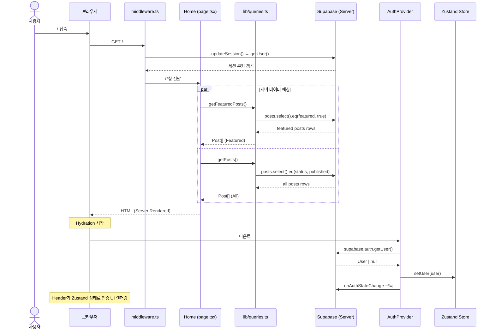

---

## 2. 게시글 상세 조회

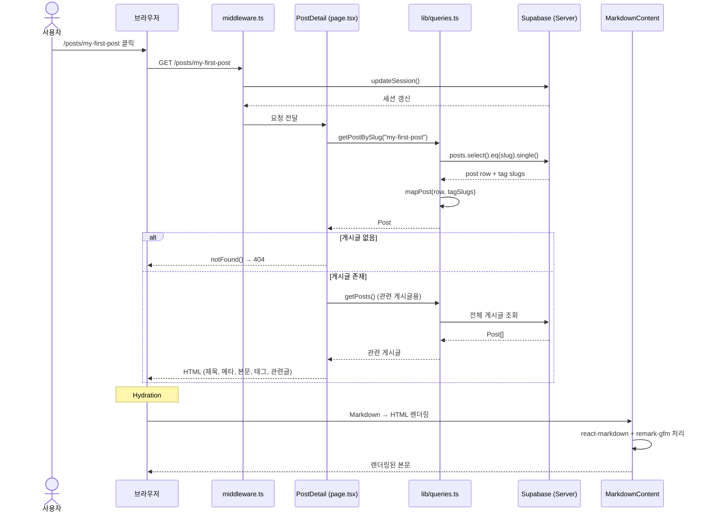

---

## 3. Ctrl+K 검색

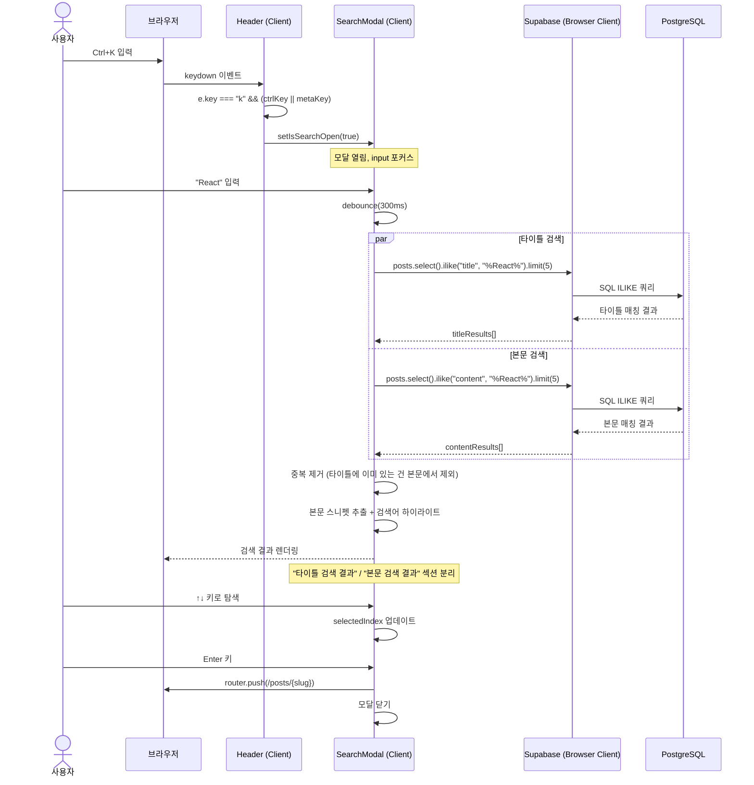

---

## 4. OAuth 로그인 (GitHub/Google)

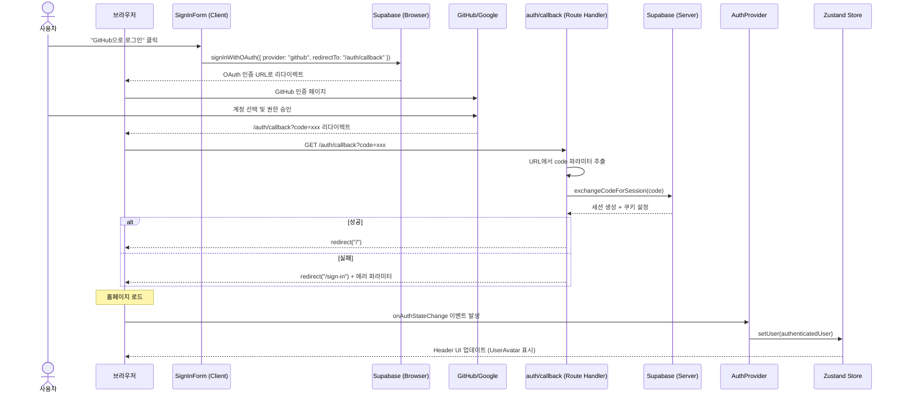

---

## 5. 이메일 로그인

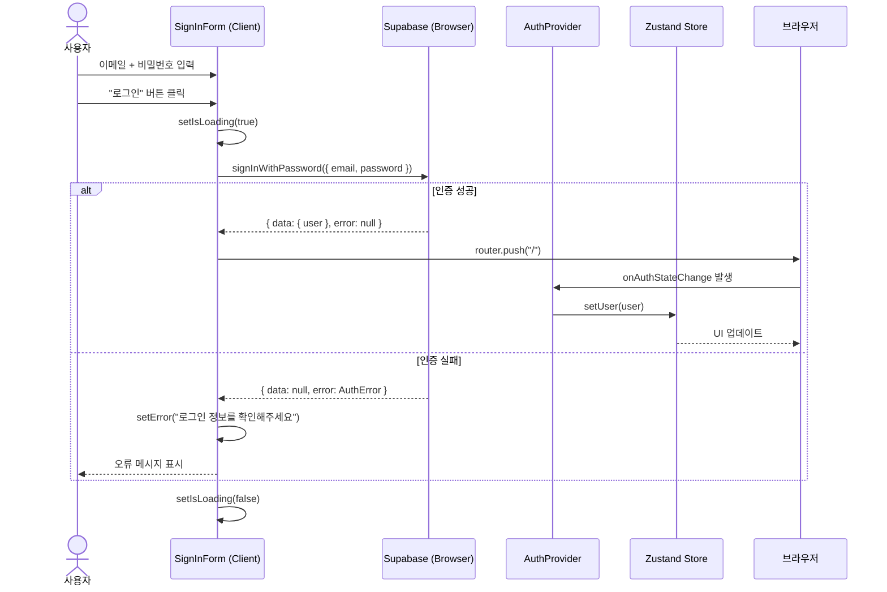

---

## 6. 게시글 작성 (관리자)

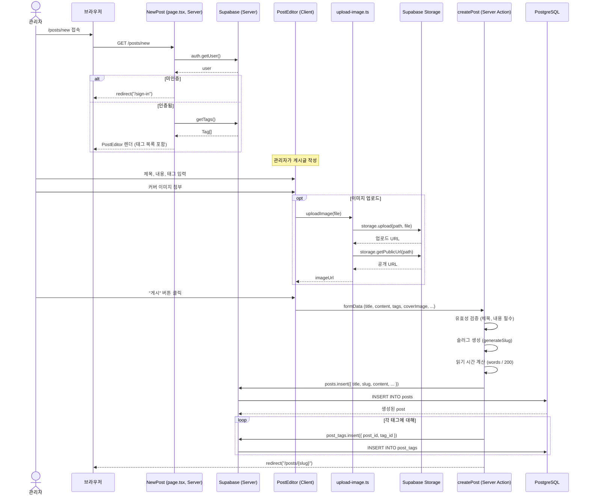

---

## 7. 게시글 수정

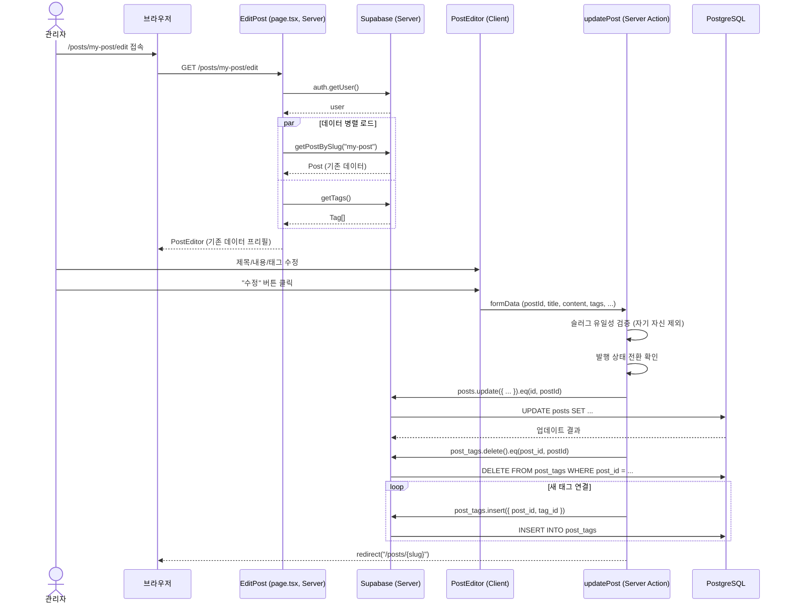

---

## 8. 게시글 삭제

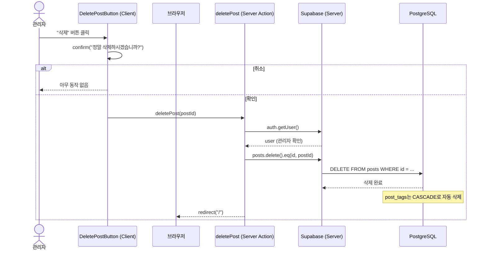

---

## 9. 태그 관리 (관리자)

```mermaid
sequenceDiagram
    actor Admin as 관리자
    participant Browser as 브라우저
    participant Page as AdminTags (page.tsx)
    participant Manager as TagManager (Client)
    participant Action as Tag Server Actions
    participant Supabase as Supabase (Server)
    participant DB as PostgreSQL

    Admin->>Browser: /admin/tags 접속
    Browser->>Page: GET /admin/tags

    Page->>Supabase: getTags()
    Supabase-->>Page: Tag[]
    Page-->>Browser: TagManager 렌더

    Note over Manager: 태그 목록 표시

    rect rgb(40, 40, 60)
        Note right of Admin: 태그 생성
        Admin->>Manager: 이름, 슬러그, 설명 입력
        Admin->>Manager: "추가" 클릭
        Manager->>Action: createTag(formData)
        Action->>Supabase: tags.insert({ name, slug, description })
        Supabase->>DB: INSERT INTO tags
        DB-->>Supabase: 생성 완료
        Action-->>Browser: revalidatePath("/admin/tags")
    end

    rect rgb(40, 60, 40)
        Note right of Admin: 태그 수정
        Admin->>Manager: 기존 태그 수정
        Manager->>Action: updateTag(formData)
        Action->>Supabase: tags.update({ ... }).eq(id, tagId)
        Supabase->>DB: UPDATE tags SET ...
        Action-->>Browser: revalidatePath
    end

    rect rgb(60, 40, 40)
        Note right of Admin: 태그 삭제
        Admin->>Manager: "삭제" 클릭
        Manager->>Action: deleteTag(tagId)
        Action->>Supabase: tags.delete().eq(id, tagId)
        Supabase->>DB: DELETE FROM tags
        Action-->>Browser: revalidatePath
    end
```

---

## 10. 회원가입

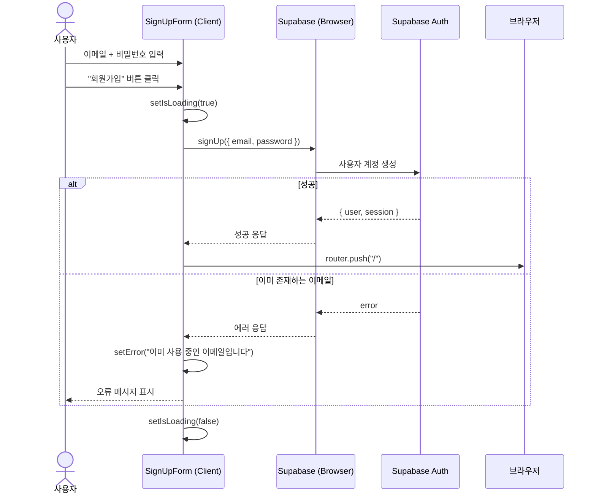

---

## 11. 태그별 게시글 필터링

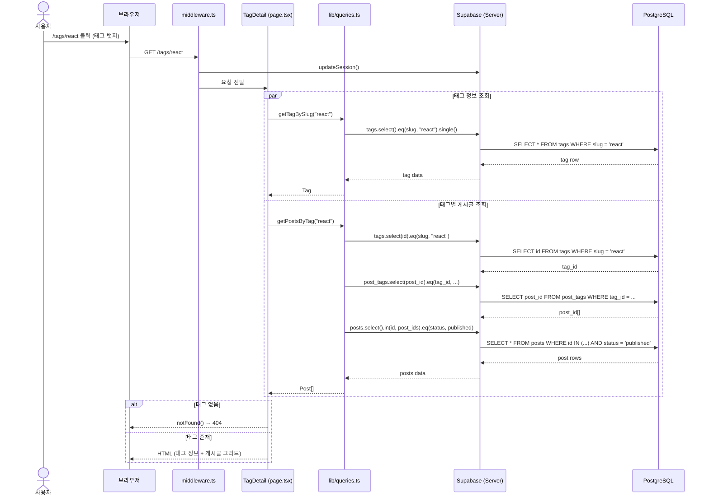

---

## 12. 미들웨어 세션 갱신 (모든 요청)

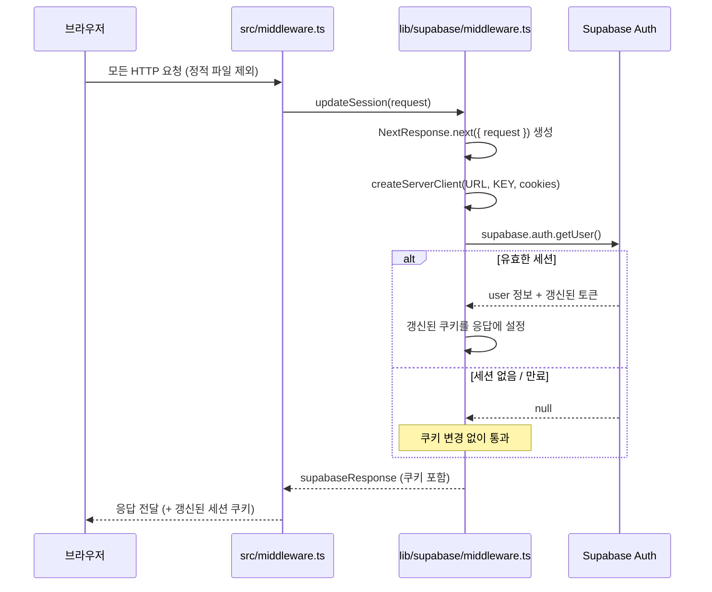
