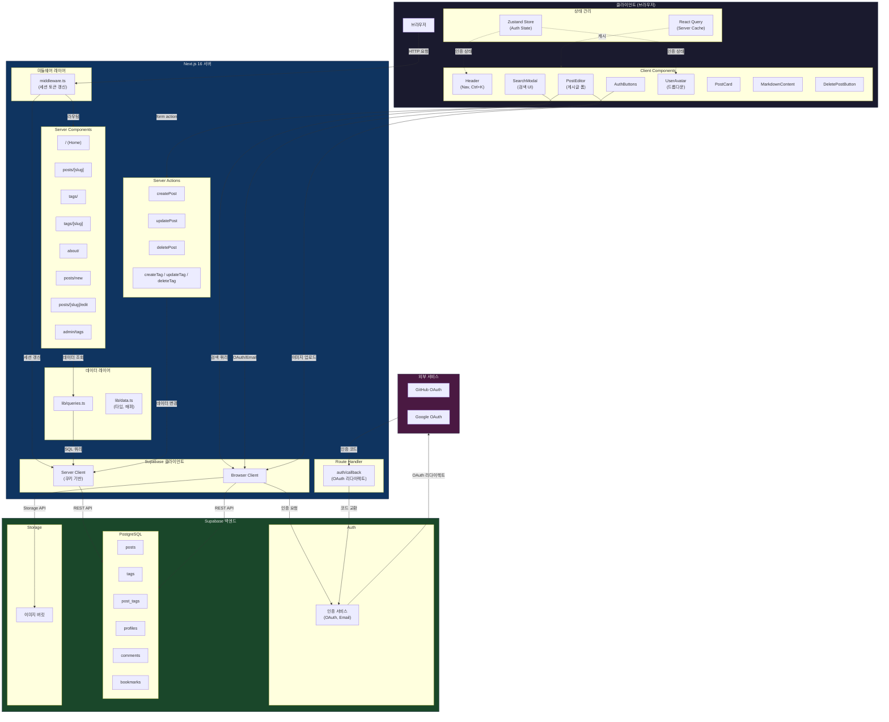
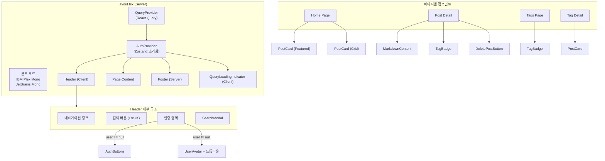
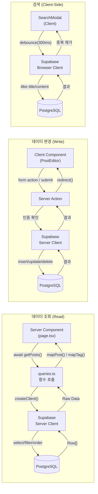
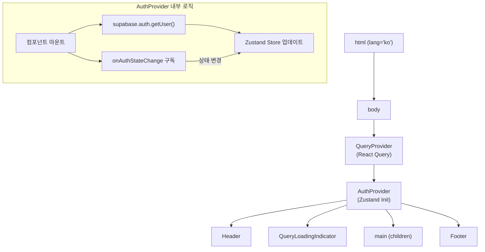
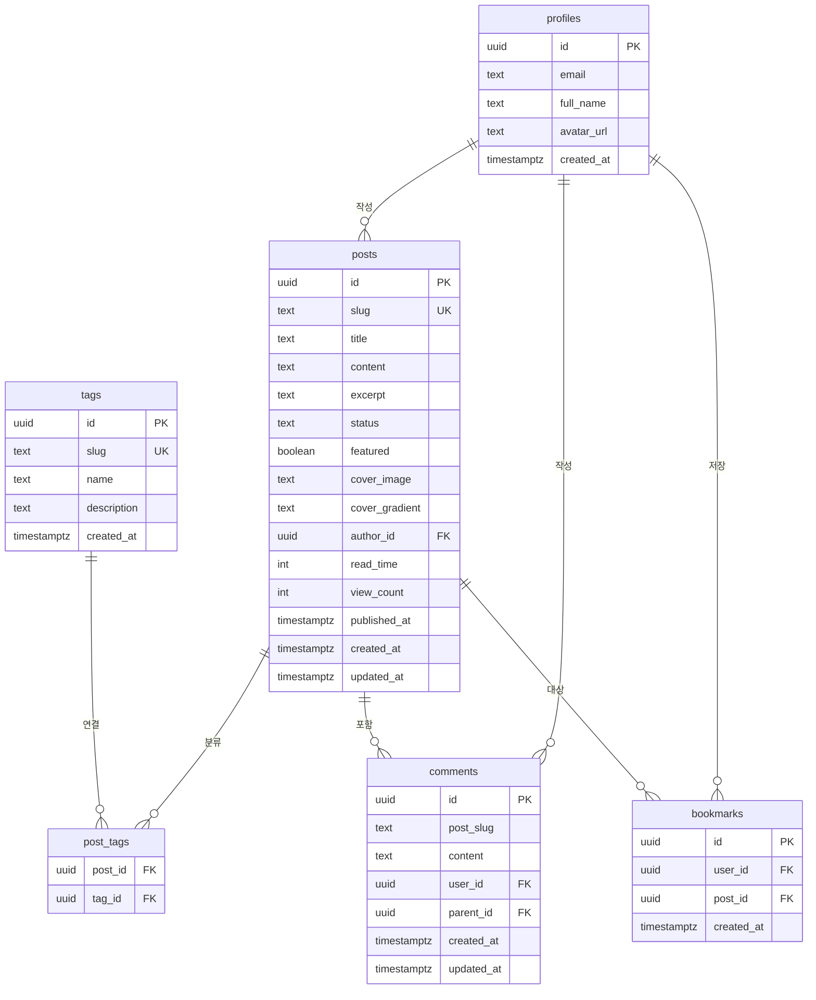
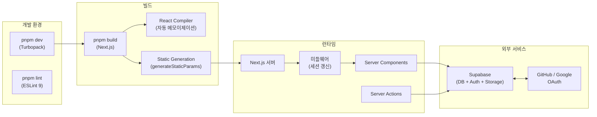

# Spectra 시스템 다이어그램

## 1. 전체 시스템 아키텍처

```mermaid
graph TB
    subgraph Client["클라이언트 (브라우저)"]
        Browser["브라우저"]
        subgraph ClientComponents["Client Components"]
            Header["Header<br/>(Nav, Ctrl+K)"]
            SearchModal["SearchModal<br/>(검색 UI)"]
            PostEditor["PostEditor<br/>(게시글 폼)"]
            AuthButtons["AuthButtons"]
            UserAvatar["UserAvatar<br/>(드롭다운)"]
            PostCard["PostCard"]
            MarkdownContent["MarkdownContent"]
            DeletePostBtn["DeletePostButton"]
        end
        subgraph StateManagement["상태 관리"]
            Zustand["Zustand Store<br/>(Auth State)"]
            ReactQuery["React Query<br/>(Server Cache)"]
        end
    end

    subgraph NextServer["Next.js 16 서버"]
        subgraph Middleware["미들웨어 레이어"]
            MW["middleware.ts<br/>(세션 토큰 갱신)"]
        end
        subgraph ServerComponents["Server Components"]
            HomePage["/ (Home)"]
            PostPage["posts/[slug]"]
            TagsPage["tags/"]
            TagPage["tags/[slug]"]
            AboutPage["about/"]
            NewPostPage["posts/new"]
            EditPostPage["posts/[slug]/edit"]
            AdminTagsPage["admin/tags"]
        end
        subgraph ServerActions["Server Actions"]
            CreatePost["createPost"]
            UpdatePost["updatePost"]
            DeletePost["deletePost"]
            TagActions["createTag / updateTag / deleteTag"]
        end
        subgraph DataLayer["데이터 레이어"]
            Queries["lib/queries.ts"]
            DataMapper["lib/data.ts<br/>(타입, 매퍼)"]
        end
        subgraph SupabaseClients["Supabase 클라이언트"]
            ServerClient["Server Client<br/>(쿠키 기반)"]
            BrowserClient["Browser Client"]
        end
        subgraph RouteHandler["Route Handler"]
            OAuthCallback["auth/callback<br/>(OAuth 리다이렉트)"]
        end
    end

    subgraph Supabase["Supabase 백엔드"]
        subgraph SupaAuth["Auth"]
            AuthService["인증 서비스<br/>(OAuth, Email)"]
        end
        subgraph SupaDB["PostgreSQL"]
            Posts["posts"]
            Tags["tags"]
            PostTags["post_tags"]
            Profiles["profiles"]
            Comments["comments"]
            Bookmarks["bookmarks"]
        end
        subgraph SupaStorage["Storage"]
            ImageBucket["이미지 버킷"]
        end
    end

    subgraph External["외부 서비스"]
        GitHub["GitHub OAuth"]
        Google["Google OAuth"]
    end

    %% 클라이언트 → 서버 흐름
    Browser -->|"HTTP 요청"| MW
    MW -->|"세션 갱신"| ServerClient
    MW -->|"라우팅"| ServerComponents

    %% 서버 컴포넌트 → 데이터
    ServerComponents -->|"데이터 조회"| Queries
    Queries -->|"SQL 쿼리"| ServerClient
    ServerClient -->|"REST API"| SupaDB

    %% 서버 액션 → 데이터
    ServerActions -->|"데이터 변경"| ServerClient
    PostEditor -->|"form action"| ServerActions

    %% 클라이언트 → Supabase 직접 통신
    SearchModal -->|"검색 쿼리"| BrowserClient
    BrowserClient -->|"REST API"| SupaDB
    AuthButtons -->|"OAuth/Email"| BrowserClient
    BrowserClient -->|"인증 요청"| AuthService

    %% OAuth 흐름
    AuthService -->|"OAuth 리다이렉트"| External
    External -->|"인증 코드"| OAuthCallback
    OAuthCallback -->|"코드 교환"| AuthService

    %% 상태 관리
    Zustand -.->|"인증 상태"| Header
    Zustand -.->|"인증 상태"| UserAvatar
    ReactQuery -.->|"캐시"| ClientComponents

    %% 이미지 업로드
    PostEditor -->|"이미지 업로드"| BrowserClient
    BrowserClient -->|"Storage API"| ImageBucket

    %% 스타일 적용
    style Client fill:#1a1a2e,stroke:#16213e,color:#eaeaea
    style NextServer fill:#0f3460,stroke:#16213e,color:#eaeaea
    style Supabase fill:#1a472a,stroke:#16213e,color:#eaeaea
    style External fill:#4a1942,stroke:#16213e,color:#eaeaea
```

---

## 2. 컴포넌트 구성도

```mermaid
graph TD
    subgraph RootLayout["layout.tsx (Server)"]
        Fonts["폰트 로드<br/>IBM Plex Mono<br/>JetBrains Mono"]
        QueryProvider["QueryProvider<br/>(React Query)"]
        AuthProvider["AuthProvider<br/>(Zustand 초기화)"]
        HeaderComp["Header (Client)"]
        Children["Page Content"]
        FooterComp["Footer (Server)"]
        LoadingIndicator["QueryLoadingIndicator (Client)"]
    end

    QueryProvider --> AuthProvider
    AuthProvider --> HeaderComp
    AuthProvider --> LoadingIndicator
    AuthProvider --> Children
    AuthProvider --> FooterComp

    subgraph HeaderDetail["Header 내부 구조"]
        Nav["네비게이션 링크"]
        SearchTrigger["검색 버튼 (Ctrl+K)"]
        AuthSection["인증 영역"]
        SearchModalComp["SearchModal"]
    end

    HeaderComp --> HeaderDetail
    AuthSection -->|"user == null"| AuthButtonsComp["AuthButtons"]
    AuthSection -->|"user != null"| UserAvatarComp["UserAvatar + 드롭다운"]

    subgraph Pages["페이지별 컴포넌트"]
        Home["Home Page"]
        PostDetail["Post Detail"]
        TagList["Tags Page"]
        TagDetail["Tag Detail"]
    end

    Home --> PostCard1["PostCard (Featured)"]
    Home --> PostCard2["PostCard (Grid)"]
    PostDetail --> MarkdownComp["MarkdownContent"]
    PostDetail --> TagBadge["TagBadge"]
    PostDetail --> DeleteBtn["DeletePostButton"]
    TagList --> TagBadge2["TagBadge"]
    TagDetail --> PostCard3["PostCard"]
```

---

## 3. 데이터 흐름도

```mermaid
flowchart LR
    subgraph ReadFlow["데이터 조회 (Read)"]
        direction TB
        SC["Server Component<br/>(page.tsx)"]
        QF["queries.ts<br/>함수 호출"]
        SSC["Supabase<br/>Server Client"]
        DB[(PostgreSQL)]

        SC -->|"await getPosts()"| QF
        QF -->|"createClient()"| SSC
        SSC -->|"select/filter/order"| DB
        DB -->|"Row[]"| SSC
        SSC -->|"Raw Data"| QF
        QF -->|"mapPost() / mapTag()"| SC
    end

    subgraph WriteFlow["데이터 변경 (Write)"]
        direction TB
        CC["Client Component<br/>(PostEditor)"]
        SA["Server Action"]
        SSC2["Supabase<br/>Server Client"]
        DB2[(PostgreSQL)]

        CC -->|"form action / submit"| SA
        SA -->|"인증 확인"| SSC2
        SSC2 -->|"insert/update/delete"| DB2
        DB2 -->|"결과"| SSC2
        SSC2 -->|"결과"| SA
        SA -->|"redirect()"| CC
    end

    subgraph SearchFlow["검색 (Client-Side)"]
        direction TB
        SM["SearchModal<br/>(Client)"]
        BC["Supabase<br/>Browser Client"]
        DB3[(PostgreSQL)]

        SM -->|"debounce(300ms)"| BC
        BC -->|"ilike title/content"| DB3
        DB3 -->|"결과"| BC
        BC -->|"중복 제거"| SM
    end
```

---

## 4. 인증 흐름도

```mermaid
flowchart TD
    subgraph OAuthFlow["OAuth 인증 흐름"]
        A["사용자: 로그인 클릭<br/>(GitHub/Google)"]
        B["signInWithOAuth()"]
        C["외부 OAuth 제공자<br/>(GitHub/Google)"]
        D["사용자 동의"]
        E["auth/callback/route.ts"]
        F["exchangeCodeForSession()"]
        G["세션 쿠키 설정"]
        H["홈으로 리다이렉트"]

        A --> B
        B --> C
        C --> D
        D -->|"인증 코드"| E
        E --> F
        F --> G
        G --> H
    end

    subgraph EmailFlow["이메일 인증 흐름"]
        EA["사용자: 이메일/비밀번호 입력"]
        EB["signInWithPassword()"]
        EC{"인증 성공?"}
        ED["Zustand Store 업데이트"]
        EE["홈으로 리다이렉트"]
        EF["오류 메시지 표시"]

        EA --> EB
        EB --> EC
        EC -->|"Yes"| ED --> EE
        EC -->|"No"| EF
    end

    subgraph SessionRefresh["세션 갱신 흐름"]
        SA["모든 HTTP 요청"]
        SB["middleware.ts"]
        SC["updateSession()"]
        SD["supabase.auth.getUser()"]
        SE["갱신된 쿠키 설정"]
        SF["요청 계속 처리"]

        SA --> SB --> SC --> SD --> SE --> SF
    end
```

---

## 5. Provider 래핑 구조

```mermaid
graph TD
    HTML["html (lang='ko')"]
    Body["body"]
    QP["QueryProvider<br/>(React Query)"]
    AP["AuthProvider<br/>(Zustand Init)"]
    H["Header"]
    QLI["QueryLoadingIndicator"]
    Main["main (children)"]
    F["Footer"]

    HTML --> Body
    Body --> QP
    QP --> AP
    AP --> H
    AP --> QLI
    AP --> Main
    AP --> F

    subgraph AuthProviderLogic["AuthProvider 내부 로직"]
        Mount["컴포넌트 마운트"]
        GetUser["supabase.auth.getUser()"]
        Subscribe["onAuthStateChange 구독"]
        UpdateStore["Zustand Store 업데이트"]

        Mount --> GetUser
        GetUser --> UpdateStore
        Mount --> Subscribe
        Subscribe -->|"상태 변경"| UpdateStore
    end
```

---

## 6. 데이터베이스 ERD

```mermaid
erDiagram
    profiles ||--o{ posts : "작성"
    profiles ||--o{ comments : "작성"
    profiles ||--o{ bookmarks : "저장"
    posts ||--o{ post_tags : "분류"
    tags ||--o{ post_tags : "연결"
    posts ||--o{ comments : "포함"
    posts ||--o{ bookmarks : "대상"

    profiles {
        uuid id PK
        text email
        text full_name
        text avatar_url
        timestamptz created_at
    }

    posts {
        uuid id PK
        text slug UK
        text title
        text content
        text excerpt
        text status
        boolean featured
        text cover_image
        text cover_gradient
        uuid author_id FK
        int read_time
        int view_count
        timestamptz published_at
        timestamptz created_at
        timestamptz updated_at
    }

    tags {
        uuid id PK
        text slug UK
        text name
        text description
        timestamptz created_at
    }

    post_tags {
        uuid post_id FK
        uuid tag_id FK
    }

    comments {
        uuid id PK
        text post_slug
        text content
        uuid user_id FK
        uuid parent_id FK
        timestamptz created_at
        timestamptz updated_at
    }

    bookmarks {
        uuid id PK
        uuid user_id FK
        uuid post_id FK
        timestamptz created_at
    }
```

---

## 7. 배포 구조

```mermaid
graph LR
    subgraph Development["개발 환경"]
        Dev["pnpm dev<br/>(Turbopack)"]
        Lint["pnpm lint<br/>(ESLint 9)"]
    end

    subgraph Build["빌드"]
        BuildCmd["pnpm build<br/>(Next.js)"]
        RC["React Compiler<br/>(자동 메모이제이션)"]
        SSG["Static Generation<br/>(generateStaticParams)"]
    end

    subgraph Runtime["런타임"]
        Server["Next.js 서버"]
        MW["미들웨어<br/>(세션 갱신)"]
        SC["Server Components"]
        SA["Server Actions"]
    end

    subgraph External["외부 서비스"]
        Supabase["Supabase<br/>(DB + Auth + Storage)"]
        OAuth["GitHub / Google<br/>OAuth"]
    end

    Dev --> BuildCmd
    BuildCmd --> RC
    BuildCmd --> SSG
    SSG --> Server
    Server --> MW
    MW --> SC
    SC --> Supabase
    SA --> Supabase
    Supabase <--> OAuth
```
